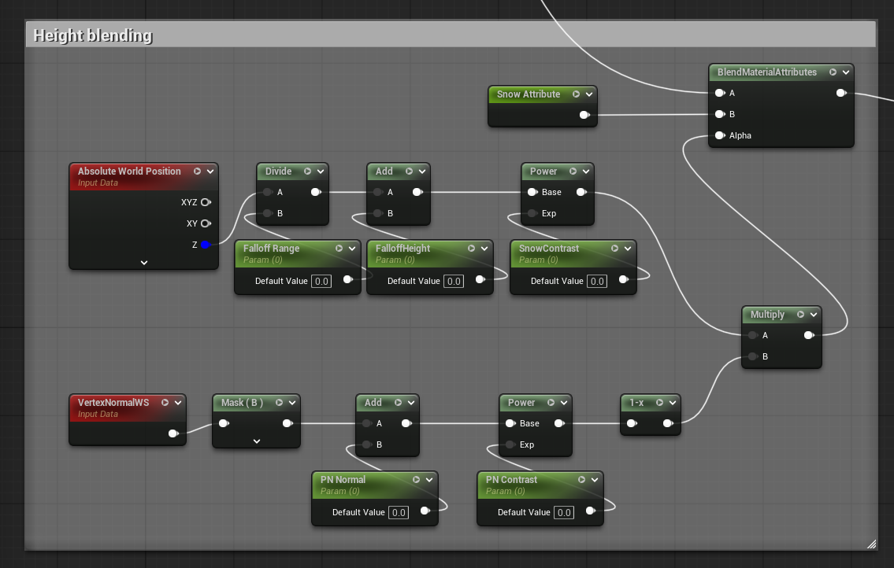
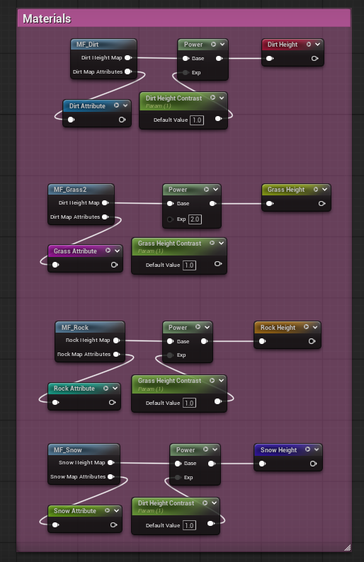
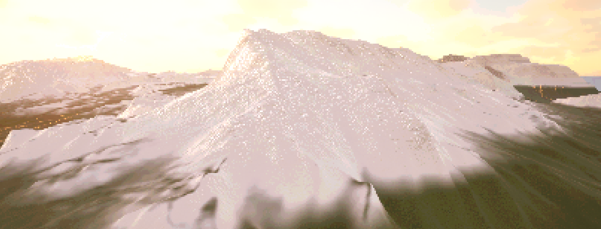
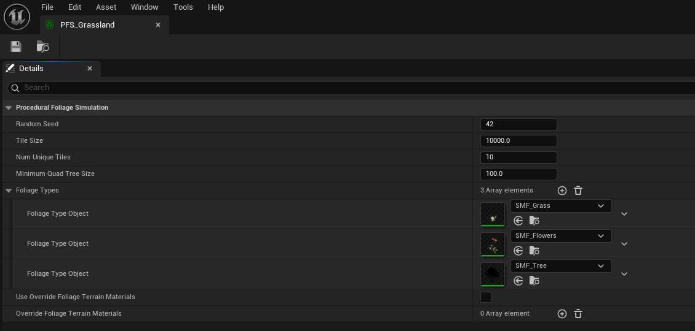
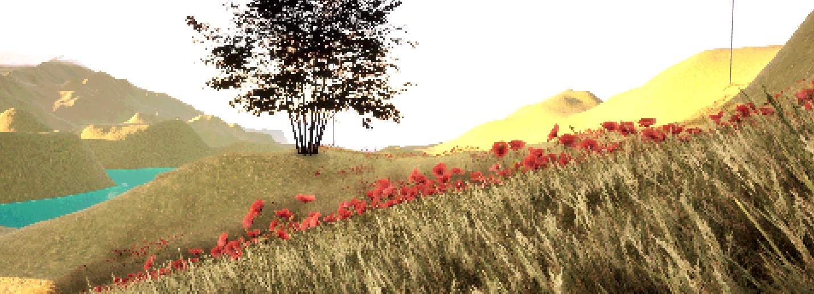

### Week 3 Deliverable One - Height based blending system

As part of the first deliverable I created a height based blending system that would automatically blend snowy mountains with grassy ones dependant on the height of certain peaks in the map. This was done by taking in the world position and using a vertex normal plugged in to a blend material attributes in order to allow unreal to calculate, based on dependant parameters I had set up, how to create the material height blend.

Figure 14. Height blending blueprint

As seen in figure 14, I created height blending by using an `Absolute World Position` that was then ran through various functions like divide, add and power, each with their own parameters in order to allow me to tweak the parameters in a material instance after it would be applied to the terrain. The `Absolute World Position` only needs Z as the Z axis is what determines height. `VertexNormalWS` is then ran through a mask and various functions each with their own parameters and eventually put into a multiply alongside the previous `Absolute World Position` in order to be plugged into the alpha of a `BlendMaterialAttributes` that would then be plugged into the landscape master material.

Figure 15. Set up of materials that were used and then also plugged into the master material.

Figure 15 also displays my setup of materials that each have their own contrast parameters used in order to determine certain materials in my landscape layer blend, they are all put into a named reroute for extra cleanliness.

Figure 16. Showcasing the blending

As seen in figure 16, after tweaking my material instance values I ended up with a blend that looked pretty good in my opinion. Obviously with my post processing material from the previous week some features would be distorted a little though you can see near the peak how well the blend looks. 

### How do you prevent harsh transitions while maintaining distinct biome characteristics?

To prevent harsh transitions most of it boils down to playing around with various parameters in order to create a realistic looking blend that keeps biome characteristics incredibly visible towards the sweet spot of their biome, in the case of snow, near the peak where the most snow would formulate. Then just gradually tweaking values in order to make sure the falloff beneath that feels realistic and gradual rather than instant and  harsh. I also looked into (Schütz, 2024) and (Landscape Materials in Unreal Engine | Unreal Engine 5.6 Documentation | Epic Developer Community, s.d.) to deepen my understanding of height and layered blending.

### What height ranges work best for different landscape scales? 

Based on Epic games' official documentation (Landscape Technical Guide in Unreal Engine | Unreal Engine 5.6 Documentation | Epic Developer Community, s.d.) your ideal Z value for your terrain will usually fall within the 250-400 range with some variance depending on what exact landscape you're making / using. In my case my landscape's Z value was 400 in order to better emphasise the mountains of the terrain I chose. Though for flatter landscapes you would probably be on the lower end. (What is the recommended size for a height map (terrain) to import in Unreal Engine - Development / World Creation, 2018). Based on some user forums, a general rule of thumb people use is that 1 pixel in a heightmap is equivalent to 1 square meter and thus by following this rule of thumb you could end up with decently realistic heightmaps.

### How does height blending interact with other blending systems?

Height blending typically works well with slope blending as by having both systems in place you can better show off things like slope blending with nicely height blended landscapes too and the two are often seen used together in landscaping in order to create beautiful landscapes. Especially if layer blending is also involved, as seen in this forum (Sharper landscape layer height blending? - Development / Rendering, 2021).

---

### Week 3 Deliverable Two - Slope-Based Blending System

For the second deliverable, I worked on a slope-based blending system. This system is designed to automatically texture the landscape based on the angle of the terrain, applying different materials to flat areas versus steep cliffs.

[PLACEHOLDER: Detailed explanation of the slope blending implementation, specific nodes used, and parameter settings. Waiting for .COPY file reference.]

Figure 17. Slope blending blueprint

[PLACEHOLDER: Description of the blueprint setup shown in Figure 17.]

Figure 18. Slope blending result

[PLACEHOLDER: Description of the visual result shown in Figure 18.]

### How do you handle overhangs and complex geometry?

[PLACEHOLDER: Explanation of handling overhangs, typically involving tri-planar mapping or specific mesh blending techniques.]

### What slope angles create the most natural-looking transitions?

[PLACEHOLDER: Discussion on natural slope angles, often finding that transitions around 30-45 degrees provide a realistic shift from soil/grass to rock.]

### How can slope blending enhance the sense of geological realism?

[PLACEHOLDER: Thoughts on geological realism, ensuring that erosion patterns and material distribution mimic real-world physics.]

---

### Week 3 Deliverable Three - Foliage Type Integration and Generation

For the final deliverable, I integrated a procedural foliage system to populate the landscape with vegetation. I used a **Procedural Foliage Spawner** named `PFS_Grassland` to manage the distribution of different plant types across the terrain.

Figure 19. Procedural Foliage Spawner setup

As seen in Figure 19, the `PFS_Grassland` spawner includes three distinct foliage types: Grass, Flowers, and Trees. Each type references a specific "Instanced Static Mesh" foliage type asset with unique settings for density and distribution.

1.  **Grass (`SMF_Grass`)**: This foliage type uses a wild grass mesh (`SM_vlkhcbxia_VarA`). I set the **Initial Seed Density** to `10.0` and the **Average Spread Distance** to `90.0`. This ensures a dense, lush ground cover that fills the open spaces of the landscape. It is set to `bCanGrowInShade=True`, allowing it to appear even in shadowed areas.

2.  **Flowers (`SMF_Flowers`)**: To add color and variety, I included a field poppy mesh (`SM_vmcobd0ja_VarB`). The density for flowers is lower, with an **Initial Seed Density** of `1.5` and an **Average Spread Distance** of `40.0`. This creates scattered patches of flowers rather than a uniform carpet, mimicking natural growth patterns.

3.  **Trees (`SMF_Tree`)**: For the larger vegetation, I used a common hazel tree mesh (`SM_CommonHazel_Field_01`). The tree settings are left at defaults in the provided file, but the spawner handles their placement to ensure they don't overlap unrealistically with the smaller vegetation layers.

Figure 20. Final landscape with procedural foliage

Figure 20 demonstrates the final result where the `PFS_Grassland` has been simulated on the landscape. The grass and flowers provide a rich ground layer, while the trees add verticality and scale to the environment.

### How do you create believable ecosystem distributions?

To create believable distributions, it's important to layer foliage types based on their roles in the ecosystem. I used high-density grass as a base layer, scattered flowers for detail, and trees as accent pieces. Adjusting the `Initial Seed Density` and `Average Spread Distance` allows for natural clustering, preventing the "perfectly spaced" look that can feel artificial.

### What factors determine foliage density in real environments?

In real environments, foliage density is determined by factors like sunlight availability, soil quality, and competition for resources. In Unreal, we simulate this using parameters like `bCanGrowInShade` and density settings. For example, the grass has a high density to simulate a healthy meadow, while flowers are sparser, representing their more specific growth requirements.

### How do you balance visual richness with performance?

Balancing richness and performance involves careful management of density and draw calls. By using **Instanced Static Meshes** (as referenced in the `FoliageType_InstancedStaticMesh` classes), the engine can render thousands of instances efficiently. Additionally, setting appropriate cull distances and using LODs (Levels of Detail) for the meshes ensures that the game runs smoothly even with dense vegetation.
  

## BIBLIOGRAPHY

Schütz, A. (2024) How to Use Landscape Layer Blending and Height Blending | Unreal Engine 5 Tutorial. At: https://artur-schuetz.com/tutorials/article/how-to-use-landscape-layer-blending-and-height-blending (Accessed  07/11/2025).

Landscape Materials in Unreal Engine | Unreal Engine 5.6 Documentation | Epic Developer Community (s.d.) At: https://dev.epicgames.com/documentation/en-us/unreal-engine/landscape-materials-in-unreal-engine?utm_source=chatgpt.com (Accessed  07/11/2025).

Landscape Technical Guide in Unreal Engine | Unreal Engine 5.6 Documentation | Epic Developer Community (s.d.) At: https://dev.epicgames.com/documentation/en-us/unreal-engine/landscape-technical-guide-in-unreal-engine (Accessed  07/11/2025).

What is the recommended size for a height map (terrain) to import in Unreal Engine - Development / World Creation (2018) At: https://forums.unrealengine.com/t/what-is-the-recommended-size-for-a-height-map-terrain-to-import-in-unreal-engine/106477?utm_source=chatgpt.com (Accessed  07/11/2025).

Sharper landscape layer height blending? - Development / Rendering (2021) At: https://forums.unrealengine.com/t/sharper-landscape-layer-height-blending/155838?utm_source=chatgpt.com (Accessed  07/11/2025).
