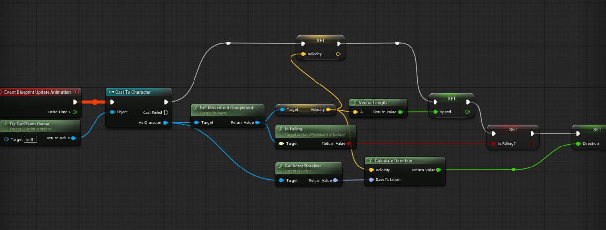
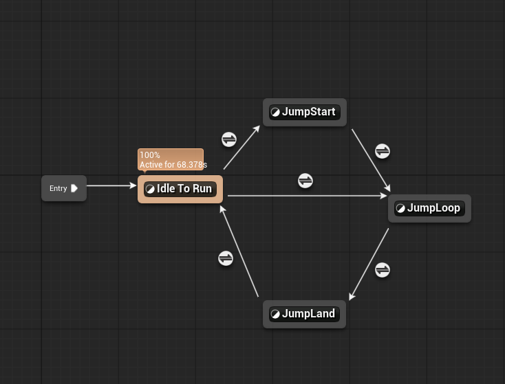
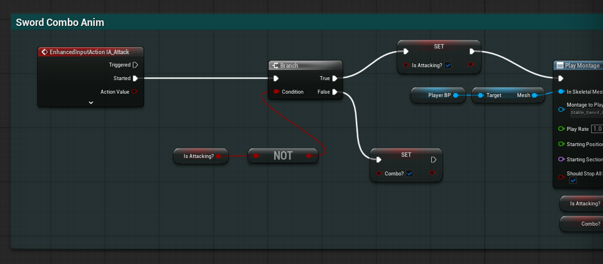
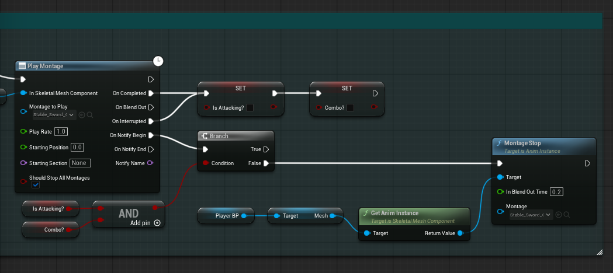
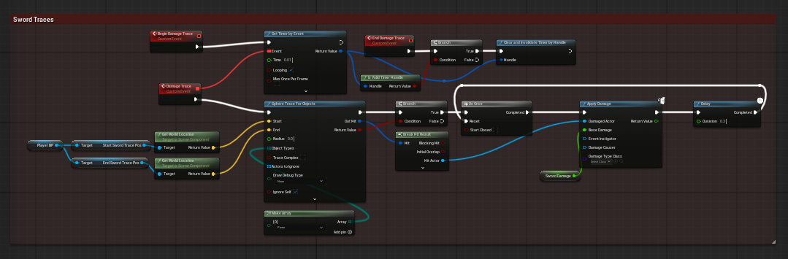
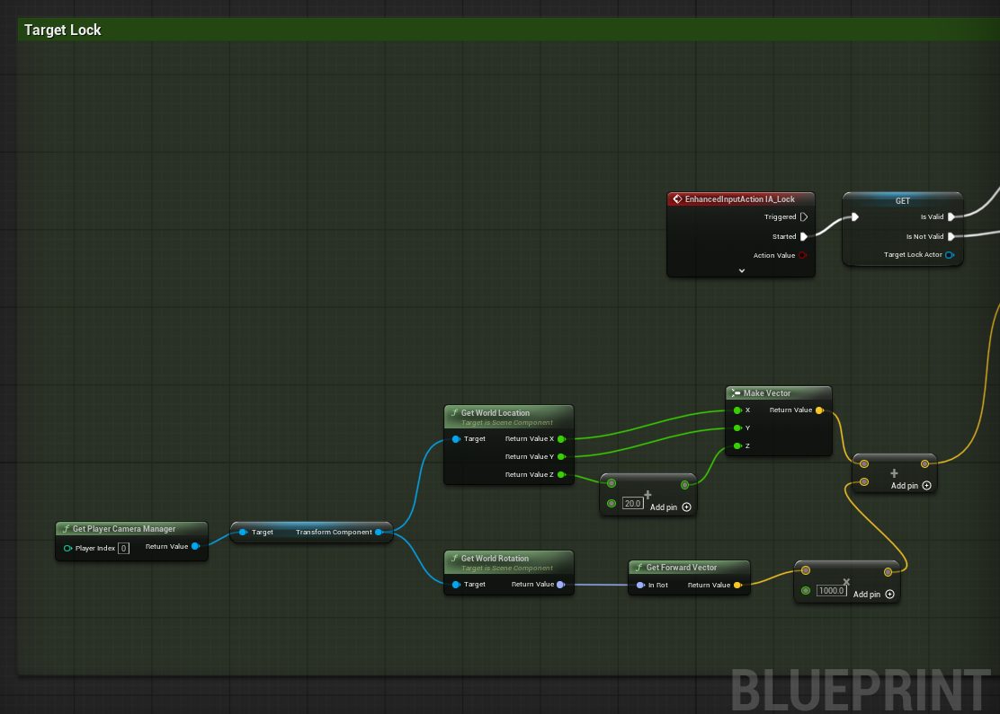
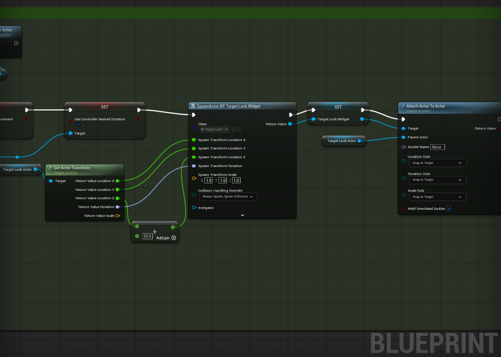
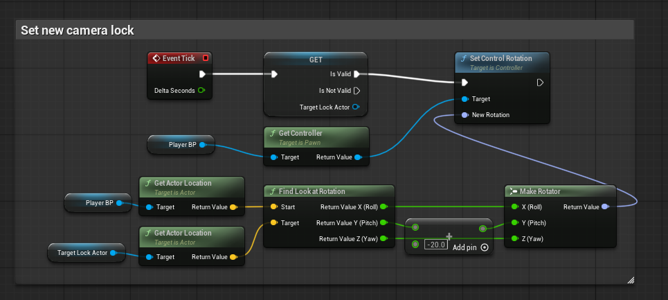

# Animation Systems Task

## 1. Animation Blueprint with Locomotion System

### Research

The research for this project was scarce due to the fact that a lot of the stuff I needed to learn was covered in class however I still did some research on my own due to the fact that the comabt system I was creating was a lot more akin to the darksouls series and thus adjustments needed to be made. 

For the first task I looked into Unreal's documentation of locomotion systems in engine. (Locomotion in Unreal Engine | Unreal Engine 5.7 Documentation | Epic Developer Community, s.d.). This vae me a pretty clear idea of how to implement the locomotion system in my character.

Furthermore, given the dark souls inspiration I was going for, I did a little research into the Dark Souls movement system. (How do you implement a DodgeRoll like Dark souls? - Programming & Scripting / Blueprint, 2017). I found this incredibly useful forum post discussing the movement system of dark souls and how it works and specific implementations into unreal. 

I also briefly read through the dark souls wiki in order to better understand the nuances of its combat system. (COMBAT, 2023). For obvious reasons I would have to cut a lot of it but it was interesting to see how it specifically worked and what parts I could adapt into my own system. 

---

For the first part of this task, I set up the Animation Blueprint `ABP_Alien` to handle the character's basic movement. The core of this is the Event Graph and the Anim Graph working together.

In the Event Graph, I'm using `TryGetPawnOwner` to get the character reference and then casting it to `BP_ThirdPersonCharacter` to access its variables. I'm updating `Speed` by getting the velocity length, and `Direction` using `CalculateDirection`. I also check if the character is in the air using `IsFalling` from the movement component. These variables drive the state machine logic.

*Figure 1: The Event Graph setup showing the calculation of Speed and Direction variables.*

The Locomotion state machine has the following states:
*   **Idle To Run**: This is the main ground state. I used a Blend Space here called `ABS_Omnidirection`. It's a 2D blend space that takes `Speed` and `Direction` as inputs. This allows the character to strafe and move diagonally without sliding.
*   **JumpStart**: This plays when the character first leaves the ground.
*   **JumpLoop**: This is the falling loop that plays while the character is in the air.
*   **JumpLand**: This plays when the character hits the ground before transitioning back to Idle/Run.

*Figure 2: The Locomotion State Machine showing transitions between Idle, JumpStart, JumpLoop, and JumpLand.*

*Figure 2.5: The Locomotion State Machine in action.*

**Guiding Questions:**

*   **How do you prevent animation popping during state transitions?**
    I used blend settings in the transition rules. For example, when going from JumpLoop to JumpLand, I added a small crossfade duration (around 0.2s) so the legs don't just snap to the ground pose. Also, using a Sync Group for the locomotion states helps keep the foot cycles aligned when switching between walking and running.
*   **How does the combat state interact with locomotion states?**
    The combat animations aren't actually inside the locomotion state machine. They are handled by a Montage Slot (UpperBody or DefaultSlot) that sits after the state machine in the Anim Graph. This means the locomotion continues running in the background, but the combat montage overrides specific bones when it plays.

## 2. Combat Combo System Using Animation Montages

For the combo system I wanted to look into animation notifiers primarily as they were the key to making things work correctly. As per usual I read up on the documentation for Animation notifiers (Animation Notifies in Unreal Engine | Unreal Engine 5.7 Documentation | Epic Developer Community, s.d.) so that I could gain a deeper understanding on the inner workings of the animation notifiers. From reading up on this I effectively learned how to implement animation notifiers into an animation montage and how to use them to trigger events in blueprints.

I also looked at the animation montage documentation (Animation Montage in Unreal Engine | Unreal Engine 5.7 Documentation | Epic Developer Community, s.d.) in order to properly relate it back to my animation notifier research. 

As a baseline to start off my project I then watched through this useful tutorial (How to Create a Souls-Like Game in Unreal Engine 5 - Full Course, 2024) which allowed me to implement a combo montage, with included blueprints to allow it all to work properly. 

---

I implemented the combat system primarily within a dedicated Blueprint Component called `BPC_Combat`. This component is attached to the main character, `BP_ThirdPersonCharacter`. This modular approach keeps the combat logic separate from the movement logic. I also created a montage called `Stable_Sword_Outward_Slash_Montage`.

The montage is set up with multiple sections. I have a "Default" section for the first swing and then a second section for the follow-up attack. I used the `Stable_Sword_Outward_Slash` and `Stable_Sword_Inward_Slash` animations.

*Figure 3: The Animation Montage timeline showing the 'Default' and 'Combo' sections.*

To make the combo work, I used Animation Notifies:
*   **AnimNotify_ComboWindow**: I placed this notify near the end of the attack animation, during the recovery phase. This tells the blueprint that it's okay to accept input for the next attack.
*   **BP_Notify_Damage_C**: This is a custom notify I added at the point of impact (when the sword swings fully). This triggers the actual damage logic in the character blueprint.

In the `BPC_Combat` blueprint component, I handle the inputs `IA_Attack`. When the player clicks, it checks if they are currently in a "Combo Window". If they are, it increments a `ComboCounter` integer and calls the logic to play the next part of the animation. If they miss the window, the combo resets to zero. This system is heavily inspired by the *Dark Souls* series, rewarding deliberate timing over button mashing.

I also implemented a Lock-On system (`IA_Lock`) within `BPC_Combat` that uses a Sphere Trace to find targets, allowing the player to focus on specific enemies.

*Figure 4: The Blueprint logic handling the Combo Counter and Montage Jump to Section.*

*Figure 5: Sword Traces blueprint logic.*

*Figure 6: The lock on system blueprint logic.*

*Figure 7: Setting new lock target logic.*

*Figure 8: The full combat system in action.*

**Guiding Questions:**

*   **How do you make the combo feel responsive while maintaining animation quality?**
    The key is the "Input Buffer". I set it up so that if you press the attack button slightly *before* the combo window opens, the game remembers that input and executes it as soon as the window opens. This makes it feel much smoother than requiring frame-perfect timing.

*   **How do you prevent button mashing while rewarding timing?**
    I used a boolean check. If the player spams the button outside the combo window, the input is ignored or can even trigger a "recovery" state where they can't attack for a moment. They only get the combo continuation if they press the button during the specific window I defined in the montage.

*   **How do you communicate combo windows to the player visually?**
    While I didn't add a UI element for this yet, the animation itself acts as a cue. The "recovery" frames where the character pulls the sword back are usually when the window opens.

## 3. Animation Layering & Slot System

The animation blending was a bit more confusing for me as I didn't quite understand the whole bone blending to begin with. I read through the provided documentation (Using Layered Animations in Unreal Engine | Unreal Engine 5.7 Documentation | Epic Developer Community, s.d.) though this didn't really help me much with understanding how to actually implement it into my project. 

I then watched this youtube video (How to Blend Animations in Unreal Engine 5 - YouTube, s.d.) to help me understand how to implement the animation layering system. This was a lot more beneficial to see it visualised and eventually allowed me to actually implement it into my project.

---

Though not featured in my combat showcase, I implemented the animation layering system to allow the character to attack while moving. I eventually cut the ability to do this though as in an effort to make the combat more similar to the Dark souls series as they dont allow movement while attacking for sword based weapons.

In the Anim Graph, I used the `Layered Blend Per Bone` node.
*   **Base Pose**: This is connected to the Locomotion State Machine (legs and hips).
*   **Blend Pose 0**: This is connected to the "UpperBody" Slot.

*Figure 5: The Anim Graph showing the Layered Blend Per Bone node merging the Locomotion and UpperBody slot.*

I created a specific Slot in the Animation Blueprint called `UpperBody`. In the montage `Stable_Sword_Outward_Slash_Montage`, I set the slot to `UpperBody` instead of `DefaultSlot`.

For the `Layered Blend Per Bone` node, I set the **Bone Name** to `spine_01`. This means everything above the first spine bone (arms, head, chest) will play the montage animation, while everything below (pelvis, legs) will continue playing the locomotion animation.

**Guiding Questions:**

*   **What bone split creates the most natural upper/lower body separation?**
    I found that `spine_01` works best. If I used `pelvis`, the legs would look weirdly detached. If I used `spine_03` (upper chest), the swing would look stiff because the torso wouldn't rotate with the sword. `spine_01` allows the character to twist their torso for the swing while their legs keep running forward.

*   **How do you handle the transition between full-body and layered animations?**
    I use the "Blend Weight" on the Layered Blend Per Bone node. When a montage starts, I can smoothly blend the weight from 0 to 1. Also, for really heavy attacks that need full body movement (like a heavy slam), I just use the `DefaultSlot` which overrides the entire body, bypassing the layer blend.

*   **What blend weights feel most natural for your character?**
    I usually leave it at 1.0 for attacks so the attack looks powerful. However, for things like "hit reactions" while running, I might blend it at 0.8 so some of the running motion still affects the upper body, making it look less robotic.

Locomotion in Unreal Engine | Unreal Engine 5.7 Documentation | Epic Developer Community (s.d.) At: https://dev.epicgames.com/documentation/en-us/unreal-engine/locomotion-in-unreal-engine (Accessed  10/11/2025).

How do you implement a DodgeRoll like Dark souls? - Programming & Scripting / Blueprint (2017) At: https://forums.unrealengine.com/t/how-do-you-implement-a-dodgeroll-like-dark-souls/89292 (Accessed  10/11/2025).

COMBAT (2023) At: https://darksouls.wiki.fextralife.com/COMBAT (Accessed  10/11/2025).

Animation Notifies in Unreal Engine | Unreal Engine 5.7 Documentation | Epic Developer Community (s.d.) At: https://dev.epicgames.com/documentation/en-us/unreal-engine/animation-notifies-in-unreal-engine (Accessed  10/11/2025).

Animation Montage in Unreal Engine | Unreal Engine 5.7 Documentation | Epic Developer Community (s.d.) At: https://dev.epicgames.com/documentation/en-us/unreal-engine/animation-montage-in-unreal-engine (Accessed  10/11/2025).

How to Create a Souls-Like Game in Unreal Engine 5 - Full Course (2024) Directed by Gorka Games. At: https://www.youtube.com/watch?v=Hs2sM7eFf6Q (Accessed  10/11/2025).

Using Layered Animations in Unreal Engine | Unreal Engine 5.7 Documentation | Epic Developer Community (s.d.) At: https://dev.epicgames.com/documentation/en-us/unreal-engine/using-layered-animations-in-unreal-engine (Accessed  10/11/2025).

How to Blend Animations in Unreal Engine 5 - YouTube (s.d.) At: https://www.youtube.com/watch?v=wOIlkertaLA (Accessed  10/11/2025).

