# Week 5 - Niagara VFX Technical Report

## 1. Fire Effect

For the first effect, I created a standard fire system `NS_FireNormal` designed to be a versatile environmental asset. The core of this effect relies on a sprite renderer to create the illusion of rising flames through upward velocity and turbulence.

I started by setting up a `SpawnRate` module driven by a User Parameter `User.SpawnRate`. This allows me to control the density of the fire directly from the level instance without opening the Niagara editor. The particles are spawned from a Sphere location, giving the fire a natural, rounded base.

To make the movement feel realistic, I used `Add Velocity` with a random range, controlled by `User.MinVelocity` and `User.MaxVelocity`. I also added a `Drag` module to slow the particles down as they rise, simulating air resistance. The color transitions from a hot core to cool smoke using a `LinearColor` curve, which I also exposed as a user parameter `User.Curve for Colors`.

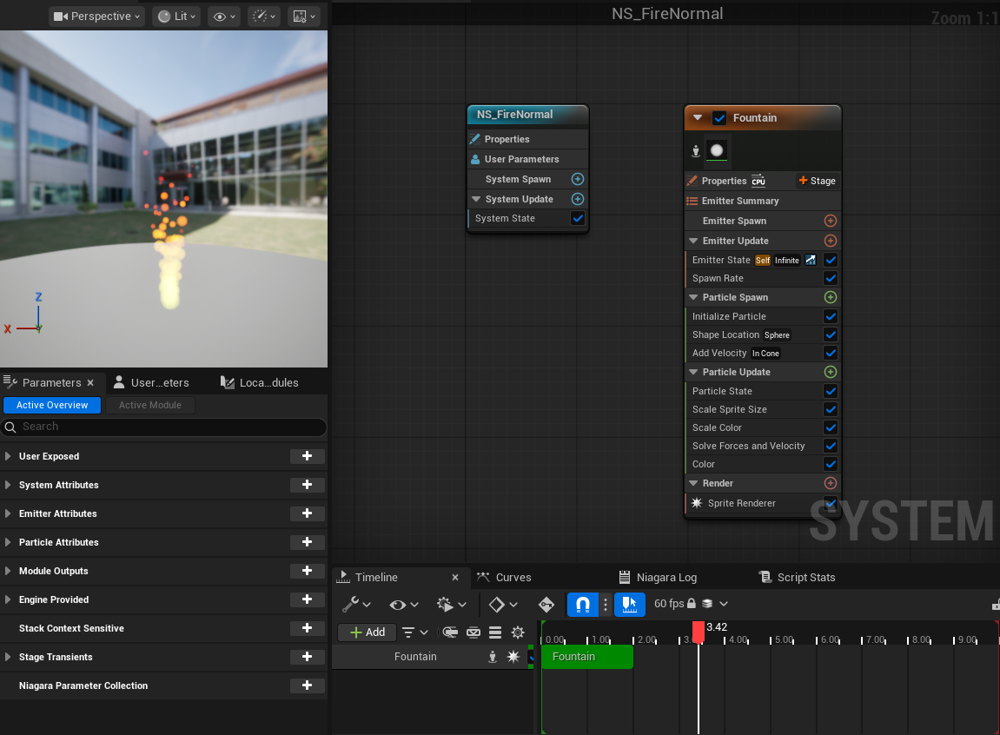
*Figure 1: The Niagara System overview for the Fire effect, showing the emitter stack.*

*Figure 2: The final Fire effect in the level.*

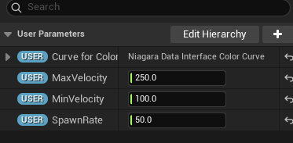
*Figure 2.1: Additional user parameters I added for the Fire effect.*

## 2. Fireball Projectile

I implemented the Fireball as a projectile-based effect, `NS_Fireball`. This system is more complex, combining a glowing core, a smoke trail, and sparks. It's designed to work with the `BP_Shooter` blueprint I set up.

The most important part of this effect is the trail. I used a `NiagaraRibbonRendererProperties` for the `Trail` emitter. This creates a smooth, continuous geometry behind the projectile, which looks much better than just spawning a line of sprites. The ribbon uses `M_Trail`, a material I set up with `MaterialExpressionPanner` to scroll two textures (`TestTexture90` and `T_Smoke_Tiled_D`) at different speeds. This makes the trail look like it's flowing and evolving, not just a static streak.

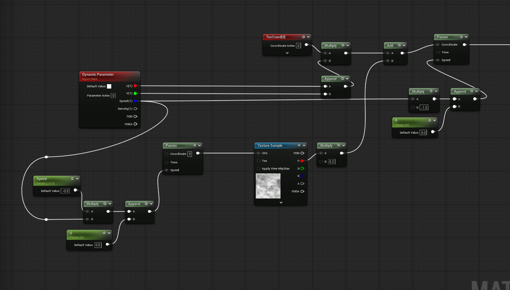
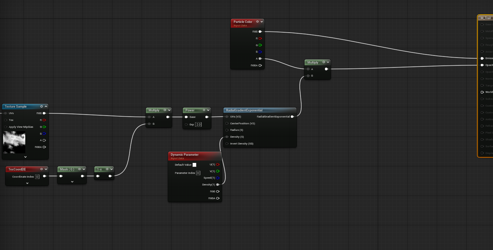
*Figure 3: The M_Trail material setup with two textures scrolling at different speeds.*

I then duplicated the emitter for FireRibbon to create a second FireRibbon which was used to add a bit more depth and variety to the Ribbon trail that would follow behind the main particle. I went in and adjusted thingsl ike the `Spawn Rate` and various parameters to make it look visually different from the main trail.

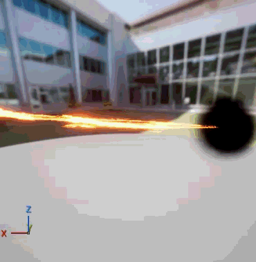 
*Figure 4: Without Second Ribbon*
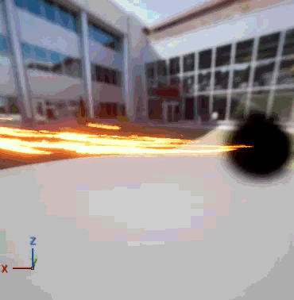
*Figure 4.1: With Second Ribbon*

I then finished it off by making emitters for the smoke and the actual fireball. This was achieved by using my M_Smoke material and various parameters to control the smoke's behavior. I also added a `Drag` module to slow the particles down as they trail behind the main particle.

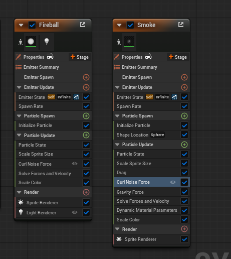

*Figure 5: The smoke and fireball emitters.*

I then very quickly set up a very basic `BP_Shooter` blueprint to spawn the projectile just so I could demonstrate how it looked being fired from a spawner.

*Figure 6: The Fireball being fired from a spawner.*

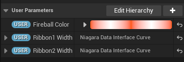
*Additional user parameters I added*

## 3. Lightning Strike

For the Lightning Strike `NS_LightningStrike`, I wanted a short-lived, high-impact effect. I used a Ribbon Renderer again and utilised a `Spawn Burst Instantaneous` in order to create the main bolt flashing effect. Combined with a short lifetime, this creates the illusion of a flash of lightning.

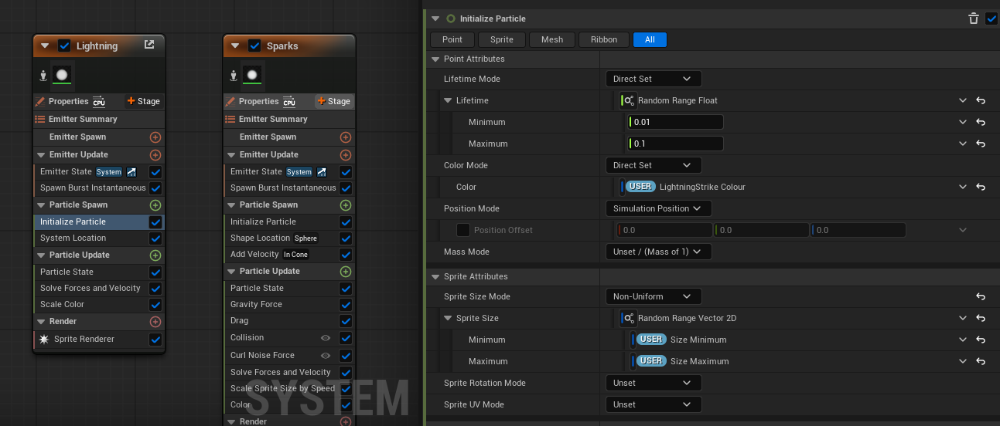
*Figure 7: The Lightning Strike emitter setup.*

In order to give the lightning some adjustable parameters too, I created a `LightningStrike` user parameter which allows the user to adjust the colour of said lightning strike. I also created a few more parameters such as `Size Minimum` and `Size Maximum` which are both Vector 2Ds in order to control the size of the lightning strike. To top it off I then added a `NoiseStrength` user parameter so you can adjust the noise strength of the lightning strike.

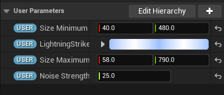
*Figure 8: The Lightning Strike user parameters.*

To add a bit more flair to the effect too, I created a new emitter which utilised a `M_Glow` which was used to create some glowing sparks that would appear when the ground was hit by the lightning.

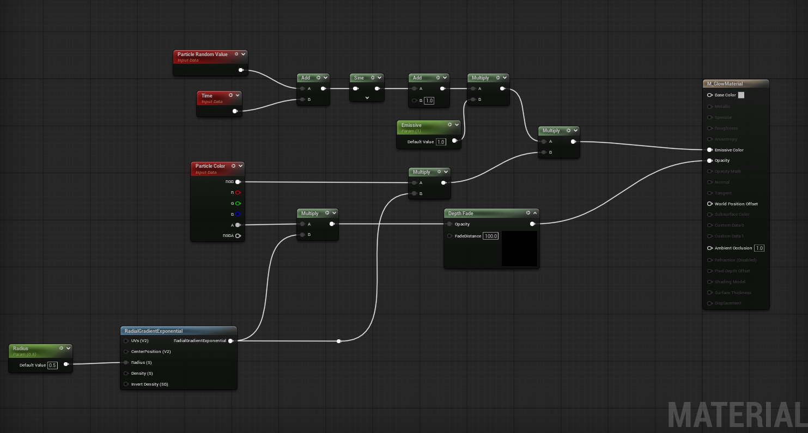
*Figure 9: Glow Material Setup*

I then adjusted a few parameters for the sparks and specifically added some `Gravity Force` and `Drag` to make the sparks look more natural and less like they were just floating in the air. This gave them a realistic look as if they would spew out from the broken ground and then bounce back to the floor.

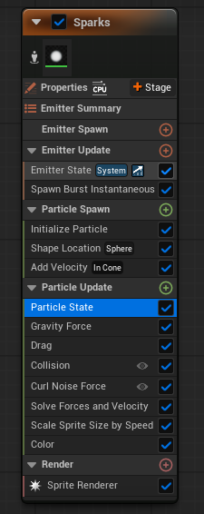
*Figure 10: Spark Emitter Setup*

*Figure 11: The final Lightning Strike effect in the level.*

## 4. Slash Attack VFX

For the Slash Attack, I utilised the `Stable_Sword_Outward_Slash_Montage` I had made in the previous week to drive the visual effects. The key to this implementation was using Animation Notifiers to trigger the effect at the precise moment of the swing.

I used the `AnimNotifyState_TimedNiagaraEffect` which is a built-in notify state that allows for the spawning of a Niagara System for a duration. I set the Template to `NS_SwordTrail` and attached it to the `WeaponTip` socket. This ensures the trail follows the tip of the blade perfectly during the animation.

*Figure 12: The AnimNotifyState_TimedNiagaraEffect setup in the animation montage.*

The `NS_SwordTrail` system itself relies on a `NiagaraRibbonRendererProperties` within the `Minimal` emitter. This renderer generates geometry between the spawned particles, creating a smooth, continuous trail that visualizes the weapon's path. The system is spawned and updated based on the duration defined in the animation notify, ensuring it only appears during the active slash frames.

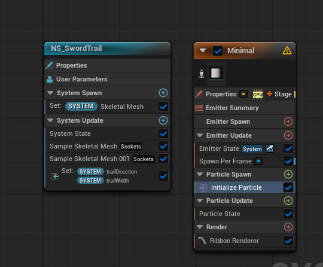
*Figure 13: The NS_SwordTrail system showing the ribbon renderer setup.*

Additionally I had to sample both sockets on the skeletal mesh of my weapon in order to get the trail to follow the tip of the blade perfectly. I then created `trailDirection` and `trailWidth` so that I would be able to directly link these vectors to the initalise particle lerp.

*Figure 14: The final Slash effect in the editor montage.*

## 5. Decal Impact

For the impact effect, I used `NS_Blood` to create a splatter on the ground. This is triggered when the attack first hits an enemy that can take damage, which then transitions into a decal when it collides with a surface.

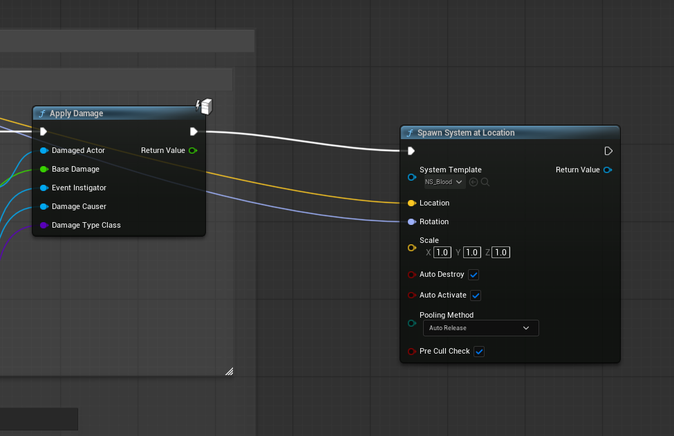
*Figure 15: The spawning system blueprints after damage is applied to the enemy.*

The core of this effect is the `Stain` emitter. It spawns a single particle that acts as a decal. I used `M_Blood`, which creates a masked stain using a texture sample. In the Blueprint logic for the notify, I perform a Line Trace to find the ground position and the Surface Normal. I pass these values to the Niagara system so the decal aligns perfectly with the floor, regardless of the slope.

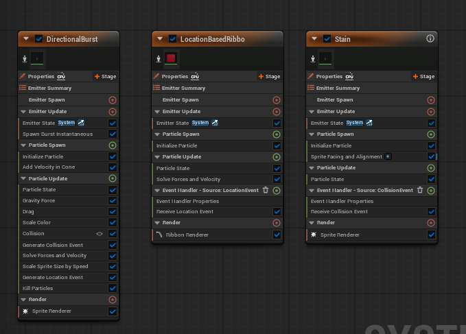
*Figure 16: The emitter setup for NS_Blood.*

I utilised a variety of user parameters too so that certain aspects such as the amount of blood splatter, how long the blood would linger for and how big the blood would be could all be adjusted accordingly if it needed to be increased or decreased for specific reasons.

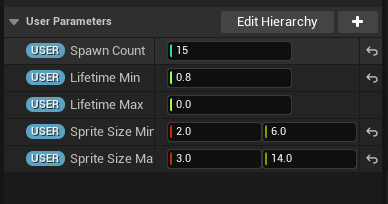
*Figure 17: The user parameters for NS_Blood.*

*Figure 18: The final Blood splatter effect.*

## 6. SubUV Flipbook Implementation

Finally, I created a high-fidelity variant of the fire effect, `NS_FireFlipbook`. Instead of a single static texture, this uses a Flipbook (SubUV) texture sheet. It is in essence just my fire effect except using a different material which supported SubUV elements. For this reason I wont be breaking down most of the setup as it is identical to the standard fire effect.

I enabled `SubUV` on the Sprite Renderer and used the `SubUVAnimation` module. This module iterates through the frames of the texture sheet over the particle's lifetime. This bakes complex fluid simulation behavior into the texture, making the fire look much more realistic and volatile than the standard sprite version.

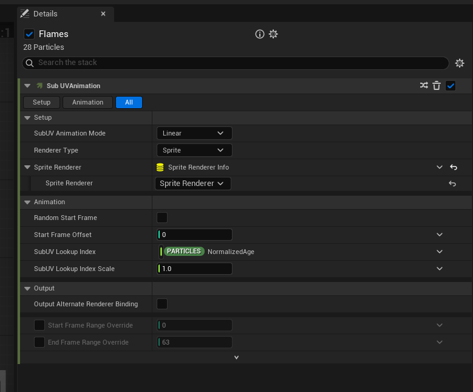
*Figure 19: The SubUV settings in the Sprite Renderer.*

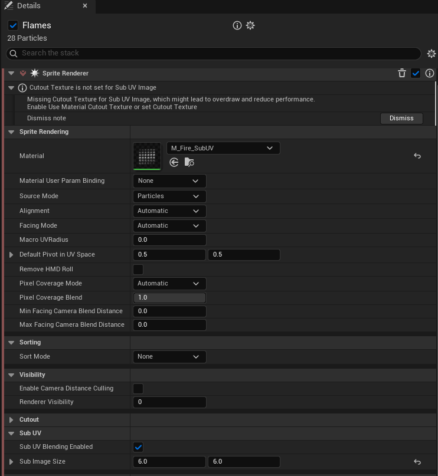
*Figure 20: The SubUV settings in the NS_FireFlipbook sprite renderer.*

I then set up a similar amount of user parameters for this one, however I also created a `Scale` user parameter to control the size of the fire. This would allow the fire to properly scale to become larger and ultimately not break when you would size it up.

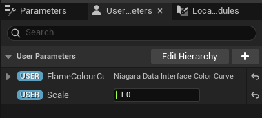
*Figure 21: The user parameters for NS_FireFlipbook.*

*Figure 22: Side-by-side comparison of the Standard Fire (left) and Flipbook Fire (right).*
