### FIRST HANDOVER.

---

# PS2 Style Cel Shader Documentation.
### Notable information

Asset Type - Material / Post Process

Author - Liliana Bellas (2326296@students.ucreative.ac.uk)

Client - Frank Budd (2310346@students.ucreative.ac.uk)

Delivery Date - 28/11/2025

*Version 1.0*

---

## Asset Overview

The PS2 style cel-shader overlays an entire scene with a very basic celshade that desaturates the scene to create a more low quality style look to all scenes it is used in.

It's key features are that it provides a celshaded look to all assets. 

Without Celshader
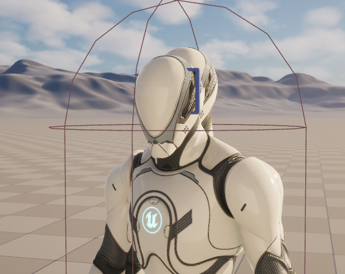

With Celshader
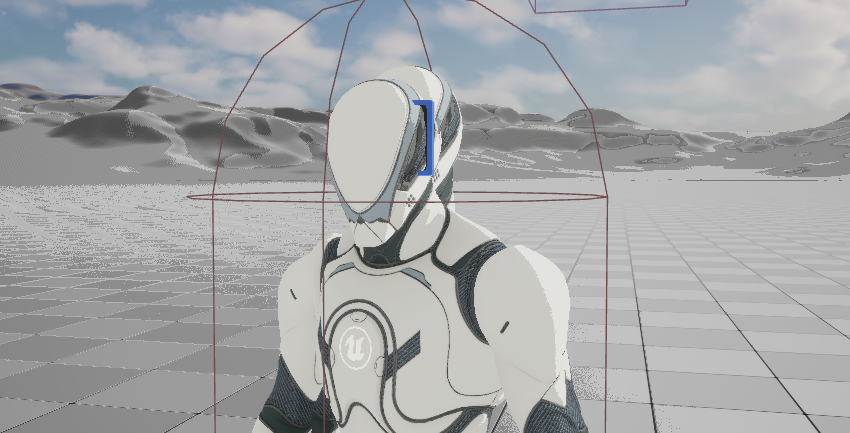

Cel Shader on various objects.
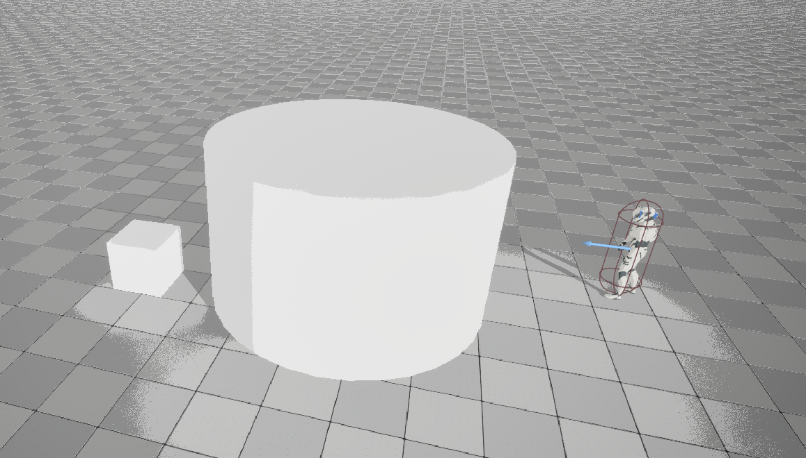

## Intergration Guide

To add this to your project, simply download the provided zip file, create a plugins folder in your unreal directory and then drag and drop the zip file in there. 

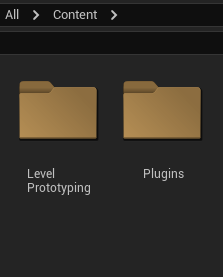

Then go to your plugins settings for your project and search 'PS2' and my plugin should show up. You will most likely then be asked to restart your editor to allow the folder to show up in your project.

From there you can navigate over to the content folder and you'll find the celshader material I have made!

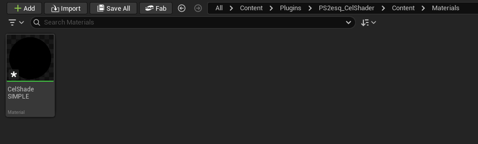

Simply create a postprocess volume in your scene and navigate down to the post process materials tab.

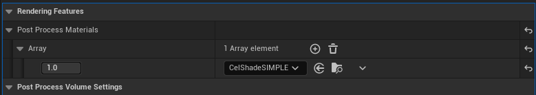

From there you can add a new entry into the array and select the CelShadeSimple material and it should apply to your scene!

## Customisation

There's limited customistaion as I was unsure of how specific you wanted the shader but if you'd like to adjust the shader's strength simply open up the material asset and adjust the created paramaters as you'd desire.

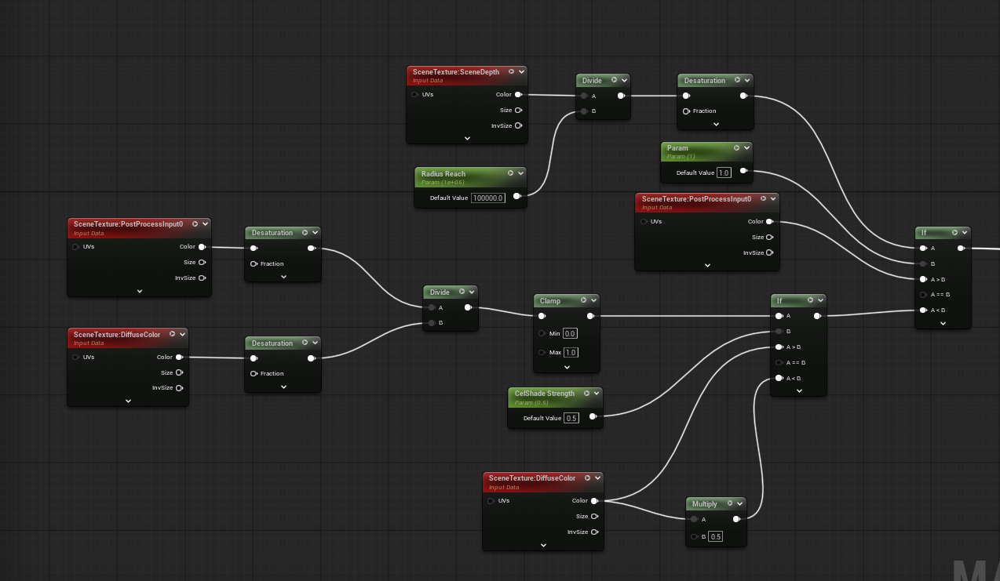

If you want a different style of shader, let me know and I'd be happy to create a new one for you!

## Technical Documentation

This postprocess material uses a variety of desaturate and divide nodes in order to create a celshaded effect which reduces light and turns it into something more akin to lighting effects from the PS2. This is done by clamping values, running them through masks and then using scenetextures to create this effect.

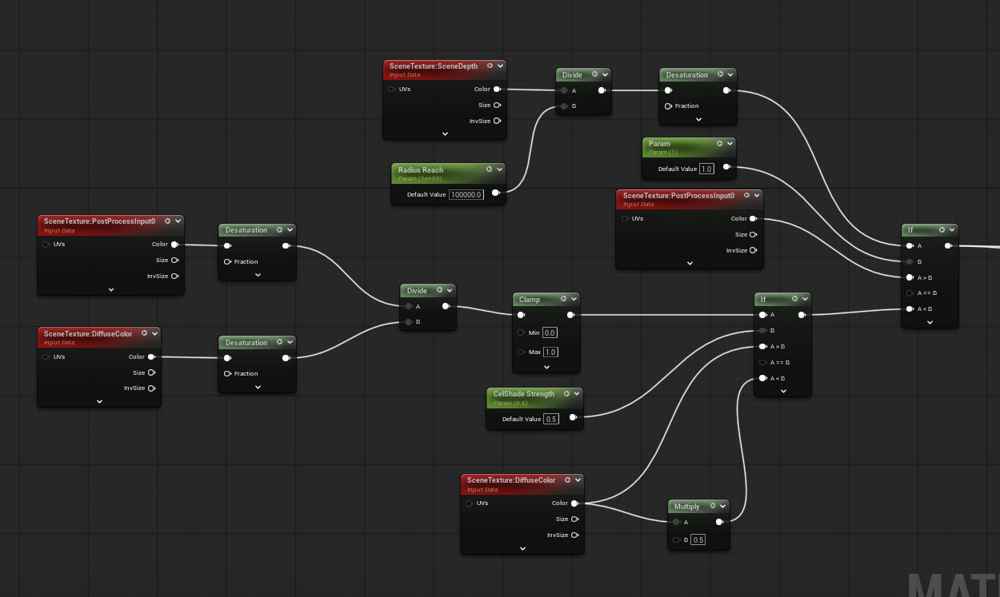

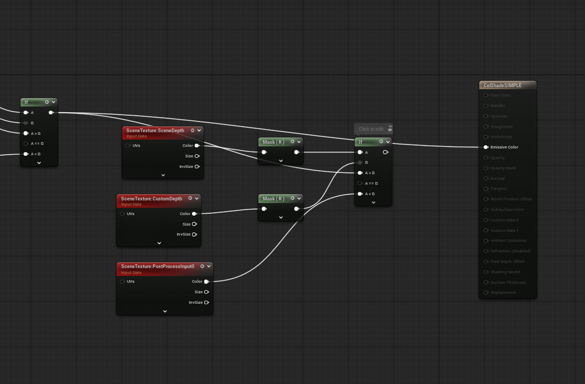

---

## Reflective Documentation

## Baseline research

For this project I wanted to take a quick look into how post processing materials worked and specifically research a couple examples of celshading in unreal engine 5 in order to properly implement it into my own project.

For this I turned to the unreal engine 5 documentation and a few online resources in order to properly implement it into my own project.

I first looked at (Post Process Materials in Unreal Engine | Unreal Engine 5.7 Documentation | Epic Developer Community, s.d.) in order to get a better understanding of how post processing materials worked and how to implement them into my own project. I then also read through a helpful forum on the UE5 page that demonstrated toon shading in Unreal Engine 5 ([UE5] Anime/Toon/Cel Shading Model (WORKS WITH LAUNCHER ENGINE VERSIONS) - Development / Rendering, 2022). This specifically gave me a lot clearer picture on the kind of asset I wanted to create and how I would go about creating it in my project. 

To round things out I then also briefly took a lot at an Unreal Engine created tutorial in their forums (Custom shading models directly in your material graphs | Community tutorial, 2024) so that I could loosely follow along with steps in my own project in order to create the celshading effect.

## Analysis

My main takeaway from my research was that creating a post process material to make a celshading effect was a lot more complex than I had initially thought. I had to do a lot of reading and research in order to properly implement it into my own project and I had to be very careful with the implementation of it as I didn't want to break anything. Since it relied heavily on the viewport of the player it was important that I also made sure it would be memory efficent as to not lower the performance of the overall project when my client was using it.

For this I decided to implement a technique I had read about where I could create a limited range around the player with the post process material so that it wasn't being constantly applied to the whole level but rather just areas of the level far enough so that the player would never be able to tell that other aspects of the level were not rendered with my post process material. 

## Client Communication 

Client communication for this particular project was incredibly limited. As I had a singular conversation with them in person about the sort of thing they were looking for when it came to this asset. 

In hindsight this was probably a bad idea as having a constant source of reference via something like an email would've been incredibly helpful for me in terms of defining what they would've wanted to a more specific level. 

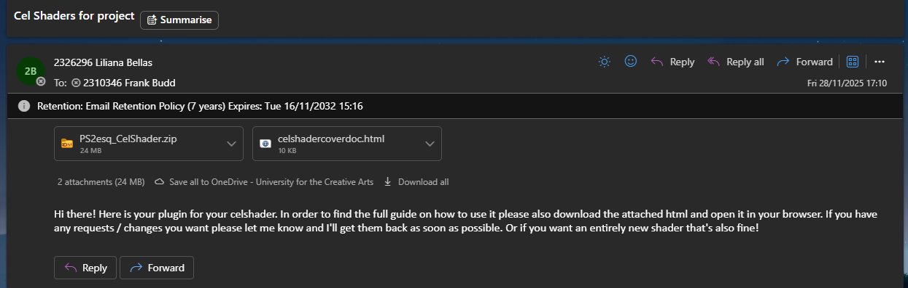
*Figure 1: Client informed that the asset had been completed. (I didn't hear back after this)*

Looking back reflectively, there was definitely a lot more I could've done personally establish a deeper line of connection for this specific asset, though it was a lesson I learned and had taken forward onto my next asset. 

## Technical Problem-Solving

Due to my Week 2 experience with creating post process materials, the concept of creating a cel shader wasn't foreign to me, thus allowing me to more effectively create this asset. I had a few issues when it came to the rendering and genearl application of this asset, mainly revolving around the implementation of it as a package though this was resolved. 

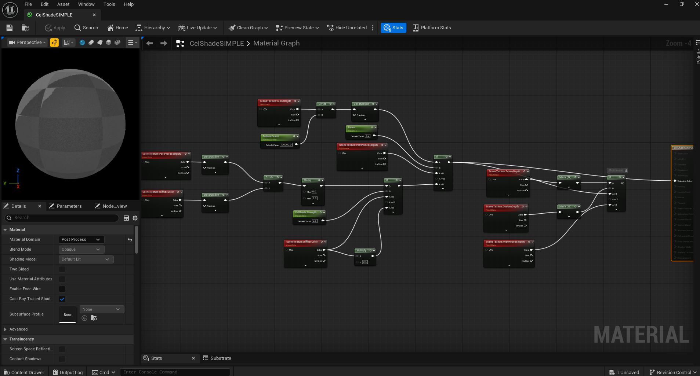
*Figure 2: Initial implementation of the cel shader.*

For some reason importing the zip file into the plugins folder didn't work initially, with it showing an empty folder in the content browser. After some troubleshooting I found out that I needed to restart my editor in order for the folder to show up and ensure that the plugins folder was placed inside the 'Content' folder.

## Workflow & Time Management

My time was managed decently well I would say. I took on two projects overall just because I was balancing creating the gamejam with Bradley and Harry in the meantime too and I wanted to place focus on that alongside this. The project was completed by the end of Week 8 and I was able to deliver the asset to the client successfully, despite not hearing anything back from them. 

My workflow mostly consisted of working on the project in one large batch so that I could keep track of what I had to do and what was left to be done without losing my train of thought. I also took the time to document my process and the asset in order to make it easier for me to understand and remember what I had done and how I had done it. This allowed me to write up the cover document a lot easier too to explain everything to the client. 

## Professional Practice

I mostly learnt that communication and lack thereof can be a real issue when it comes to outsourcing. I should've been more persistent in my attempts to contact the client and ask for feedback and clarification on what they were looking for. I also should've been more persistent in my attempts to contact the client and ask for feedback and clarification on what they were looking for. I mostly had to end up winging the project due to the fact that the client did not communicate with me much nor did I communicate with them much. 

I also learnt that it's important to hit deadlines and make sure that the client is involved in the creative process to an extent so that you can get a more accurate and desired result on the first attempt and minimise the amount of adjustments that need to be made.

## Quality vs Deadline

I had to cutback on my scope significantly due to the reason that I realised I didn't have as much time as I thought I did. Initialyl I wanted to make 2-3 variants of the cel shader and allow the client to choose between them, but I soon realised that I didn't have enough time to do so and that I would have to cutback on my scope. Especially since I had a second asset which would've required more attention as I was taking on a task I was slightly less familiar with. 

Ultimately I decided that just the one cel shader that resembled the PS2 style would be the best option for me to deliver and that I would have to cutback on my scope and focus on delivering a quality asset as opposed to a quantity of assets. I belive this was the right choice to make. 

---

## SECOND HANDOVER

# Gun Effects Documentation.
### Notable information

Asset Type - Material / Niagara System

Author - Liliana Bellas (2326296@students.ucreative.ac.uk)

Client - Michael Wintringham (2304751@students.ucreative.ac.uk)

Delivery Date - 29/11/2025

*Version 1.0*

---

## Asset Overview

The gun effects are created in order to enhance a shooter game with low fidelity, the effects were made with that in mind, utilising simple techniques to create effective and good looking effects.

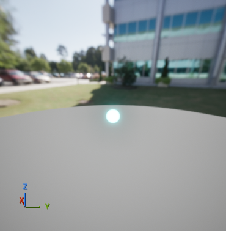

## Intergration Guide

To add this to your project, simply download the provided zip file, create a plugins folder in your unreal directory and then drag and drop the zip file in there. 

From there navigate over to your plugins tab and search gun effects and my plugin should show up! If the folder isn't showing up in your content browser you may have to restart your project.

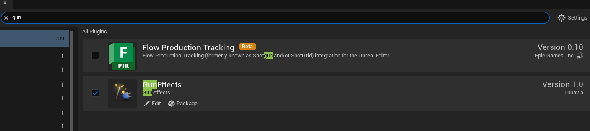

From there it's as simple as selecting my NS system in a spawn system at location function for whenever an enemy or player takes damage and it should automatically play the effects when an enemy is shot.

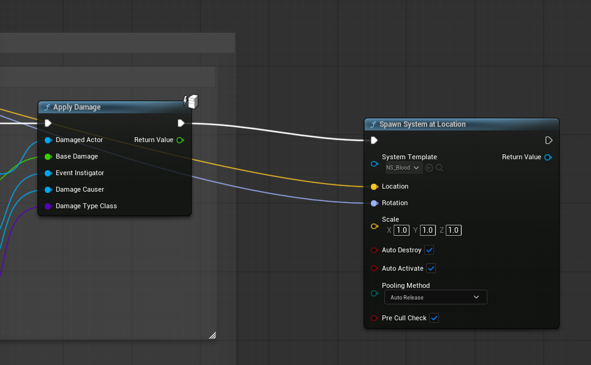

For the bullet tracer, for wherever you're spawning bullets from a gun using a system, its the same as the previous example, just make sure to use my NS_PulseBullet in order to ensure its using the correct bullet. 

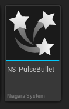

## Customisation

There's limited customistaion as you specified with the blood that it's blood so obviously it's going to be red! Thus I didn't expect you to want to customise that. Though if you want to change any of the values such as the spawn amount and rate etc, if you open up the NS_Blood and navigate over to stain, you can change any of the values such as lifetime, sprite size too for the decal that spawns on the floor.

The same settings apply for the directional burst too. 

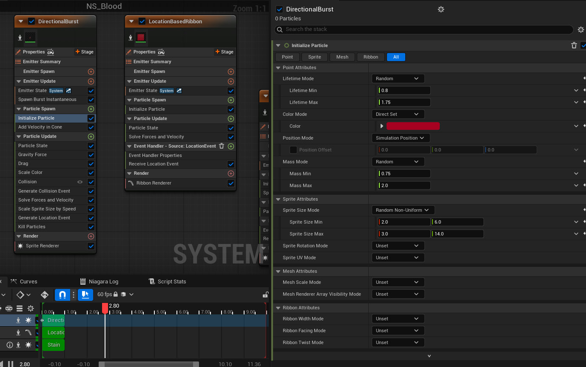

With the pulse bullet, you can adjust the colour on either the head or tail effect in order to change the colour of the bullet to your liking, I just went with cyan as you used halo as a reference and a lot of their bullets are that colour. 

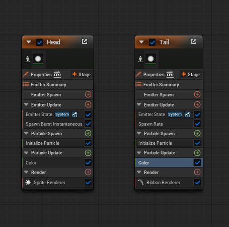

---

## Reflective Documentation

## Baseline Research

Once again, like the last asset I wanted to look into a few avenues for my research in order to better understand what I would need to do to properly implement the blood splattering effects alongside the gun bullet tracers for this client's assets. As I had barely worked with things like bullet tracers and Niagara Systems that required decals and impact decals, I wanted to look into how I could best implement them.

I did a bit more searching on the unreal engine forums like I did with my last asset and stumbled upon a few posts that were incredibly helpful. I found a post that outlined a method for creating a basic blood niagara system, (Basic Niagara Blood -- UE5/UE4 Tutorial | Community tutorial, 2025). Whilst not as in-depth as I had hoped, it was still a good starting point and provided me with a solid foundation to build upon. It allowed me to generally understand what kind of nodes I would've needed to use in order to create the blood splattering effects and that I could apply these to my Niagara system with adjustments in order to make the blood splatter I wanted. 

I also found this incredibly useful reddit post (SiiGulGames, 2024) which outlined how to properly optimise your Niagara system and that was incredibly helpful for me to understand how to properly optimise my Niagara system in order to ensure it was running at a good frame rate. Since the user who was asking the question about the frames was also using these effects for on death effects like I was planning to, I found this incredibly useful. I had understood that I wanted to ensure my system was running on a GPU based emitter rather than a CPU as the CPU emitter would tank the framerate incredibly and to ensure that my material I was using was masked instead of translucent to avoid drawing over eachother.

For the bullet effects I couldn't find much in terms of documentation and or forum posts that matched exactly what I was looking for. I found this short forum post (Need advice on how you guys make bullet tracers for an FPS game. I have questions about niagara effects and problems of tracers flickering in high speeds. - Programming & Scripting / Blueprint - Epic Developer Community Forums, s.d.) though it did not quite outline what I was looking for. Thus I turned to youtube and found a really solid tutorial on bullet tracers and effects (Easy Bullet Trails & Bullet Hits with Niagara In Unreal Engine, 2023). This tutorial significantly helped with understanding and setting up bullet trails that I would need to create.

The biggest upside of this tutorial too was how lightweight these bullet tracers and trails were so they would look incredibly effective whilst also maintaining a good frame rate. 

## Analysis

Taking away from my research I had mostly understood the general path to create the assets I needed and how long and difficult they would be based on what I had looked into. With the blood splatter being relatively simple and requiring mostly a more complex material setup than a Niagara system, I had expected it to be a bit more time consuming. However, I had underestimated the complexity of the Niagara system and the amount of time it would take to set up and optimise it. 

With the bullet effects, I had expected these to be a bit lengthier as I had to properly implement and test them in the project to ensure it was all working correctly. They did end up taking a bit longer due to this fact too as I wanted to properly ensure they looked good and ended up using the third person arena shooter variant to see them in action. 

## Client Communication

Client communication for this project was significantly better than the previous handover. Unlike the first asset, I made sure to send follow-up emails to confirm details alongside having various conversations in person. This provided a constant source of reference which was incredibly helpful for defining specific requirements and ensuring we were on the same page. Having a paper trail of our discussions meant I could always refer back to exactly what was agreed upon, preventing any ambiguity.

*Figure 3: An inital email to clarify certain details of the asset as some of it required programming which was not in my specification of my role*

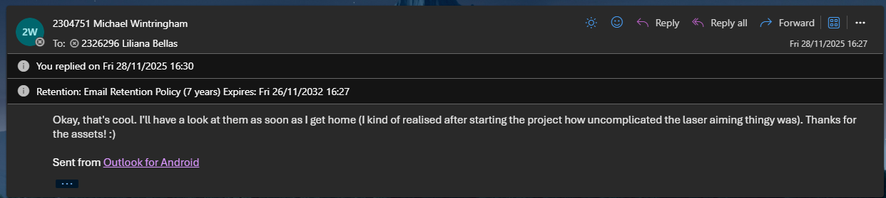
*Figure 4: Client confirmation that they could handle the programming aspect of the asset*

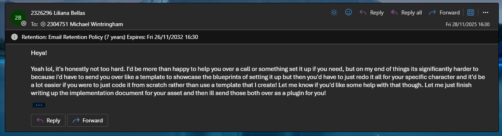
*Figure 5: My confirmation that I would handle the asset creation and the client's confirmation that they would handle the programming aspect of the asset, with assistance to implement said programming if need be*

These exchanges of emails allowed us to both better understand what we both needed to do to ensure this was a successful project exchange. Clarifying that one of his requested assets was actually purely programming and that I would not need to create an asset for him allowed the client to better understand and scope his project around this fact. This also allowed me to rescope my project as I had one less task asset to complete.

Ultimately this allowed me to better manage my time and focus on the assets I needed to create, rather than being held back by the programming aspect of the project.

## Technical Problem-Solving

My technical problem solving went a lot smoother during this project, largely due to understanding how to package assets based on my experience with the first asset. The lessons learned from the cel shader implementation allowed me to avoid similar issues and streamline the process. I encountered fewer roadblocks with the plugin structure itself, allowing me to focus more on the actual Niagara systems and material logic rather than fighting with the engine's file management.

That being said. 

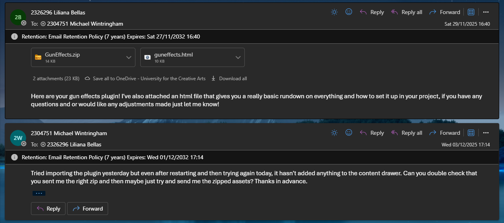
*Figure 6: The client reaching out that he had issues with implementation.*

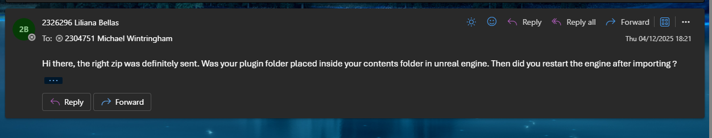
*Figure 7: My response to his query.*

Unfortunately due to the lateness of his response I was unable to adequately assist him in time to get his project with the gun effects set up and had wished he had contacted me earlier regarding the issues with the implementation so I could better assist him.

## Workflow and Time Management

The workflow and time management for this asset was a bit worse as I had taken a while to get started due to a lack of motivation. This left me with less time than I ideally would've wanted to complete it, though I managed to finish the necessary tasks. I found myself rushing towards the end, which added unnecessary stress. In the future, I need to be more disciplined about starting earlier, even when motivation is low, to avoid this crunch.

## Professional Practice

The professional practice was about the same as the first project, though with better communication practices. Working on this asset reinforced the importance of clear communication and the value of iterative feedback, even when time is tight. It highlighted that while technical skills are crucial, the ability to manage client expectations and maintain a steady workflow is equally important for a successful delivery.

## Quality vs Deadline

The balance between quality and deadline remained consistent with the previous example. Despite the time constraints caused by the slow start, I prioritized the core functionality to ensure the asset was delivered to a good standard by the deadline. Though as mentioned above, due to the clarification that one of the assets was purely programming, it also freed up some time for me to focus on the remaining two assets to make for the client, which allowed them to be of higher quality. 

## BIBLIOGRAPHY

Post Process Materials in Unreal Engine | Unreal Engine 5.7 Documentation | Epic Developer Community (s.d.) At: https://dev.epicgames.com/documentation/en-us/unreal-engine/post-process-materials-in-unreal-engine (Accessed  17/11/2025).

[UE5] Anime/Toon/Cel Shading Model (WORKS WITH LAUNCHER ENGINE VERSIONS) - Development / Rendering (2022) At: https://forums.unrealengine.com/t/ue5-anime-toon-cel-shading-model-works-with-launcher-engine-versions/544226 (Accessed  17/11/2025).

Custom shading models directly in your material graphs | Community tutorial (2024) At: https://dev.epicgames.com/community/learning/tutorials/ow0x/unreal-engine-custom-shading-models-directly-in-your-material-graphs (Accessed  17/11/2025).

Basic Niagara Blood -- UE5/UE4 Tutorial | Community tutorial (2025) At: https://dev.epicgames.com/community/learning/tutorials/zB1W/unreal-engine-basic-niagara-blood-ue5-ue4-tutorial (Accessed  23/11/2025).

SiiGulGames (2024) How to handle multiple VFX on death fps problems?. [Reddit Post] At: https://www.reddit.com/r/unrealengine/comments/1dvrwn4/how_to_handle_multiple_vfx_on_death_fps_problems/ (Accessed  23/11/2025).

Need advice on how you guys make bullet tracers for an FPS game. I have questions about niagara effects and problems of tracers flickering in high speeds. - Programming & Scripting / Blueprint - Epic Developer Community Forums (s.d.) At: https://forums.unrealengine.com/t/need-advice-on-how-you-guys-make-bullet-tracers-for-an-fps-game-i-have-questions-about-niagara-effects-and-problems-of-tracers-flickering-in-high-speeds/2234150/2 (Accessed  23/11/2025).

Easy Bullet Trails & Bullet Hits with Niagara In Unreal Engine (2023) Directed by Aziel Arts. At: https://www.youtube.com/watch?v=kdq82mAoKIc (Accessed  23/11/2025).

